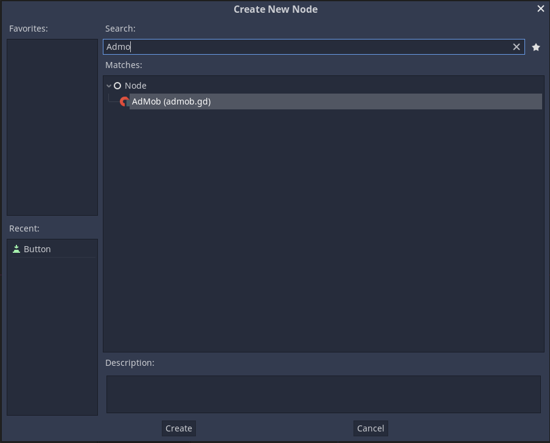
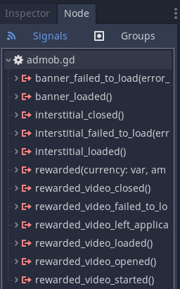

GodotAdMob
=====
This is an Android AdMob plugin for Godot Engine (https://github.com/okamstudio/godot) 3.2.2 or higher. For Godot < 3.2 or iOS support you can use the [old module](https://github.com/kloder-games/godot-admob).

Currently, this plugin supports:
- Banner
- Interstitial
- Rewarded Video

How to use
----------
- Configure, install  and enable the "Android Custom Template" for your project, just follow the [official documentation](https://docs.godotengine.org/en/latest/getting_started/workflow/export/android_custom_build.html);
- go to the [release tab](https://github.com/Shin-NiL/Godot-Android-AdMob-Plugin/releases), choose a version and download the respective ```GodotAdMobPlugin-x.x.x.zip``` package;
- extract the content of the ```admob-plugin``` directory (from the zip package) inside the ```res://android/plugins``` directory on your Godot project.
- extract the ```admob-lib``` directory (from the zip package) inside the ```res://``` directory on your Godot project.
- on the Project -> Export... -> Android -> Options -> 
    - Permissions: check the permissions for _Access Network State_ and _Internet_
    - Custom Template: check the _Use Custom Build_
    - Plugins: check the _Godot Ad Mob_ (this plugin)
- edit the file ```res//android/build/AndroidManifest.xml``` to add your App ID as described [here](https://developers.google.com/admob/android/quick-start#update_your_androidmanifestxml). For the demo project, for example, you should use:
```
        <meta-data
            android:name="com.google.android.gms.ads.APPLICATION_ID"
            android:value="ca-app-pub-3940256099942544~3347511713"/>
```
**NOTE**: everytime you install a new version of the Android Build Template this step must be done again, as the ```AndroidManifest.xml``` file will be overriden.


Now you'll be able to add an AdMob Node to your scene (**only one node should be added per scene**)



Edit its properties


And connect its signals



Sample code
-----
In the demo directory you'll find a working sample project where you can see how the things works on the scripting side.

__REMEMBER__: You still need to configure the project as described in the "How to use" section to be able to run the demo project.

Showcase
--------
Does this plugin really work? Yes sir! You can see a list of published games [here](showcase.md).


Donations
---------
Was this project useful for you? Wanna make a donation? These are the options:

### Paypal

My [Paypal donation link](https://www.paypal.com/cgi-bin/webscr?cmd=_donations&business=3MJE3M4FMJYGN&lc=BR&item_name=Shin%2dNiL%27s%20Github&item_number=Github&currency_code=USD&bn=PP%2dDonationsBF%3abtn_donate_SM%2egif%3aNonHosted)

### Brave browser

If you don't have any money, but still willing to help me you can install [Brave browser](https://brave.com/) using my [referral link](https://brave.com/shi012	). 
If you do so and keep using the browser, I'll receive some reward.

If you're already a Brave user, please consider donating some BATs ;) 


API Reference
-------------

### Properties
```python
# If true use your real ad, if false use test ads. Make sure to only set it to true with your published apk, otherwise you can be banned by Google
# type bool, default false
is_real

# If true, displays banner on the top of the screen, if false displays on the bottom 
# type bool, default true
banner_on_top

# Your app banner ad ID
# type String, optional
banner_id

# Your app interstitial ad ID
# type String, optional
interstitial_id

# Your app rewarded video ad ID
# type String, optional
rewarded_id

# If true, set the ads to children directed. If true, max_ad_content_rate will be ignored (your max_ad_content_rate would can not be other than "G")
# type bool, default false
child_directed

# If ads should be personalized. In the European Economic Area, GDPR requires ad personalization to be opt-in.
# type bool, default true
is_personalized

# Its value must be "G", "PG", "T" or "MA". If the rating of your app in Play Console and your config of max_ad_content_rate in AdMob are not matched, your app can be banned by Google
# type String, default G
max_ad_content_rate 
```

### Methods
```python

# Load the banner (and show inmediatly)
load_banner()

# Load the interstitial ad
load_interstitial()

# Load the rewarded video ad
load_rewarded_video()

# Show the banner ad
show_banner()

# Hide the banner ad		
hide_banner()

# Show the interstitial ad
show_interstitial()

# Show the rewarded video ad
show_rewarded_video()

# Check if the interstitial ad is loaded
# @return bool true if is loaded
is_interstitial_loaded()

# Check if the rewarded video ad is loaded
# @return bool true if is loaded
is_rewarded_video_loaded()

# Resize the banner (useful when the orientation changes for example)
banner_resize()

# Get the current banner dimension 
# @return Vector2 (width, height)
get_banner_dimension()

```
### Signals
```python
# Banner ad was loaded with success
banner_loaded

# Banner ad has failed to load
# @param int error_code the error code
banner_failed_to_load(error_code)

# Interstitial ad was loaded with success
interstitial_loaded

# Interstitial ad was closed
interstitial_closed

# Interstitial ad has failed to load
# @param int error_code the error code
interstitial_failed_to_load(error_code)

# Rewarded video ad was loaded with success
rewarded_video_loaded

# Rewarded video ad was closed
rewarded_video_closed

# Rewarded video ad was watched and will reward the user
# @param String currency The reward item description, ex: coin
# @param int amount The reward item amount
rewarded(currency, amount)

# The user has left application from a rewarded video ad
rewarded_video_left_application

# Rewarded video has opened
rewarded_video_opened

# Rewarded video has started to play
rewarded_video_started

# Rewarded video ad has failed to load
# @param int error_code the error code
rewarded_video_failed_to_load(error_code)
```

Troubleshooting
--------------
* First of all, please make sure you're able to compile the custom build for Android without the AdMob plugin, this way we can isolate the cause of the issue.

* Using logcat for Android is the best way to troubleshoot most issues. You can filter Godot only messages with logcat using the command: 
```
adb logcat -s godot
```
* _AdMob Java Singleton not found_: this plugin is Android only, so the AdMob Java singleton will only exists on the Android platform. In other words, you will be able to run it on an Android device (or emulator) only, it will not work on editor or on another platform.

* Error code 3 (_ERROR_CODE_NO_FILL_) is a common issue with Admob, but out of the scope to this plugin. Here's the description on the API page: [ERROR_CODE_NO_FILL: The ad request was successful, but no ad was returned due to lack of ad inventory.](https://developers.google.com/android/reference/com/google/android/gms/ads/AdRequest.html#ERROR_CODE_NO_FILL) You can find more information about the error codes [here](https://support.google.com/admob/thread/3494603).

* Banner sizes: this plugin uses [Adaptive Banners](https://developers.google.com/admob/android/banner/adaptive), you can find more information on how its sizes works on the [official AdMob documentation](https://developers.google.com/admob/android/banner/adaptive).

References
-------------
Based on the works of:
* https://github.com/Mavhod/GodotAdmob
* https://github.com/kloder-games/godot-admob

License
-------------
MIT license
